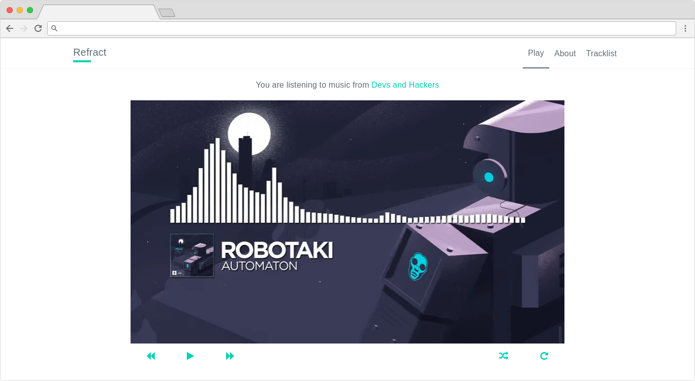

# Refract

Refract is a music player for public slack channels.



A lot of slack teams have a channel dedicated to sharing music. It's a nice place to discover new music, however it can become quite tedious to keep track of the links. What if all you wanted was to listen to the music that people post on that channel? Like a radio or a jukebox? Unfortunately slack doesn't have that feature to let you play the links posted on a channel.

Enter Refract.

Refract collects the youtube links posted on channels and then creates a playlist that can be navigated like a normal music player.

## Usage

```bash
$ git clone https://github.com/turtledev/refract
$ bash run.sh --install-deps  # install the required dependencies
$ $EDITOR config.sh           # set team name and channels 
$ bash run.sh --collect       # this may take a while
$ bash run.sh --main          # start the main app
```

Refract requires nodejs v7 and Python 3. You also need gulp (a nodejs task runner) to actually start the development server.

